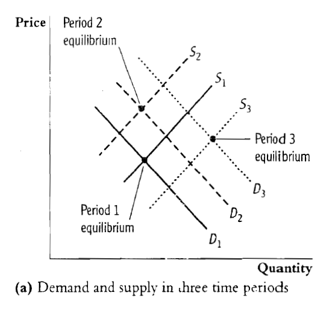
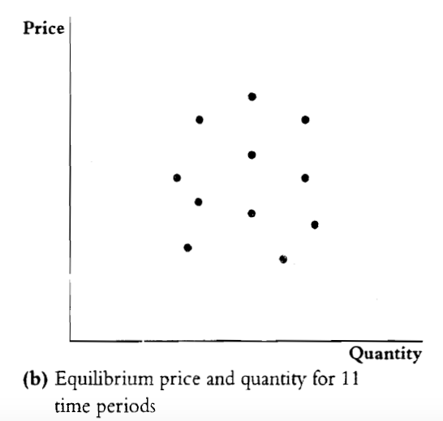
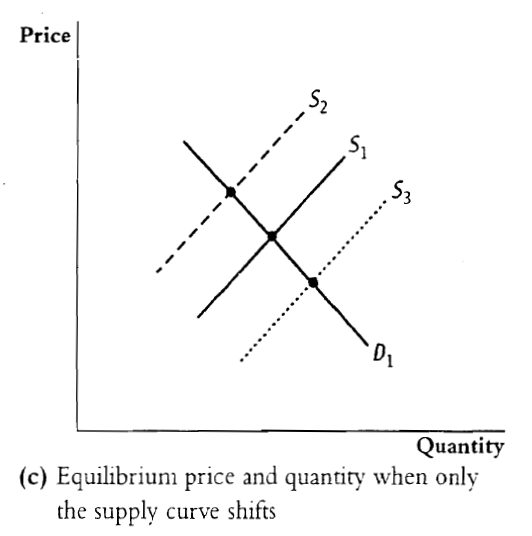

```{r setup, include=FALSE}
options(htmltools.dir.version = FALSE)
knitr::opts_chunk$set(echo = TRUE, message = FALSE, warning = FALSE)
```

```{r share-again, echo=FALSE}
xaringanExtra::use_share_again()
```

# Estimação empírica da demanda por cigarros

- A demanda por cigarros é um problema de saúde pública que tem interessado muito aos economistas

--

- Se fosse possível avaliar - de acordo com a teoria econômica - quanto de imposto seria necessário para diminuir uma determinada quantidade de cigarro consumido, a população seria beneficiada

--

- Graças aos avanços metodológicos da econometria, economistas desenvolveram ferramental para responder esta e outras perguntas

---

# Abordagem Econométrica

--

- A regressão por “mínimos quadrados” é um método bastante usado pelos economistas, tanto de regressão com um único regressor quanto com vários.

--

- O caso da estimação da demanda de um determinado produto quanto se têm informações de preço é mais difícil de estimar do que simplesmente: $$Q=\beta_{0}+\beta_{1}P+\mu$$
--

- Isto pois o preço - como sabemos pela teoria estudada até agora - é determinada pela interação entre a oferta e demanda

---
# O problema

--
- O que de fato acontece pode ser apreciado na figura

--



---
# O problema

- O que de fato acontece pode ser apreciado na figura




---
# Regressão de duas etapas

--

- A solução que os economistas pensaram foi de adicionar mais variáveis à regressão de forma que uma das curvas ficasse fixa, desta forma, os pontos seriam na verdade a forma de como estimar a outra curva.

--



---
# Voltando ao caso da demanda de cigarros

--

- No caso da estimação de cigarros, uma variável externa - instrumental - é o imposto de venda $SalesTax$.

--

- A ideia é que $SalesTax$ afeta apenas a demanda e - de forma indireta - por meio do preço.

--

- Por outro lado, $SalesTax$ não é afetada pela demanda de cigarros portanto é considerado um efeito **exógeno**.

---
# Dados usados

--

- São usados dados de 1985 a 1995 de consumo de cigarros em todos os Estados dos Estados Unidos.

```{r, echo = FALSE}
library(PoEdata)
library(systemfit)
library(tidyverse)
library(stargazer)
library(broom)
library(knitr)
library(AER)

data("CigarettesSW")

summary(CigarettesSW)

```

---

# Descrição das etapas para estimação - 2SLS

--

- Na primeira etapa é usado $SalesTax$ como regressor para o Preço $P$: $$log(P)=\pi+\pi_{1}SalesTax+\vu$$

--

- Na segunda etapa é usada a estimação de $log(P)$ como regressor para a Quantidade $Q$: $$log(Q)=\beta_{0}+\beta_{1}log(P)$$

---

# Resultados


```{r, echo=FALSE, warning= FALSE, message = FALSE, fig.width=8, fig.height=6}

CigarettesSW <- CigarettesSW %>% 
  mutate(rprice = price/cpi,
         salestax = (taxs - tax)/cpi)

cig95 <- CigarettesSW %>% 
  filter(year=="1995")

cig_ivreg <- ivreg(log(packs)~log(price) | salestax, data=cig95)

tidy(coeftest(cig_ivreg, vcov=vcovHC, type="HC1")) %>% 
  kable()

```

--

- A equação estimada é: $$log(Q)=10.17-1.08log(P)$$

--

- Ou seja, um incremento no preço dos cigarros em 1% reduz o consumo (Q) em 1.08%

--

- Como estamos falando de $\frac{\%\Delta Q}{\%\Delta P}=\frac{1.08\%}{1\%}$, este coeficiente $\beta_{1}$ representa...

--

- ...a **elasticidade-preço da demanda**

---
# Referências

*Caso queiram saber mais, seguem algumas referências (os dados vieram do livro do Stock & Watson, capítulo 12).*

- Stock, J.H.; Watson, M.W. (2011). Introduction to Econometrics, 3rd ed. Boston: Addison Wesley. Capítulo 12. Instrumental Variables Regression.

- Zhu, Aaron (2022). Causal Inference with Linear Regression: Endogeneity. Disponível em: [www.medium.com](https://medium.com/towards-data-science/causal-inference-with-linear-regression-endogeneity-9d9492663bac)

---


class: center, middle

# Fim do Apêndice

Prof. Mauricio Uriona Maldonado
