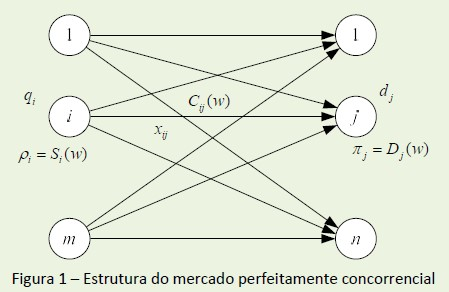
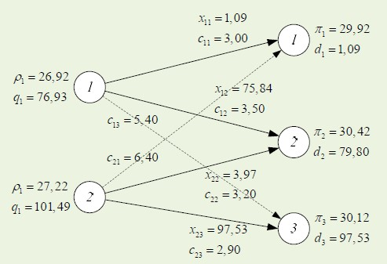

```{r setup, include=FALSE}
options(htmltools.dir.version = FALSE,
        echo = FALSE, message = FALSE, warning = FALSE)

knitr::opts_chunk$set(echo=F,
                      message=F,
                      warning=F,
                      fig.retina = 2,
                      fig.align = "center")

```

```{r xaringan-themer, include=FALSE, warning = FALSE}
library("tidyverse")
library("mosaic")
library("ggrepel")
library("fontawesome")

xaringanExtra::use_tile_view()
xaringanExtra::use_tachyons()
xaringanExtra::use_freezeframe()
xaringanExtra::use_share_again()
```

# Mercado de Refino de Petróleo

- O mercado de refino de petróleo pode ser considerado como um mercado competitivo (onde há concorrência ou competição perfeita)

- Vamos supor que o mercado de refino de petróleo possua as curvas de oferta e demanda a seguir:

  - Oferta: $$S(Q)=10+0,075Q$$
  - Demanda: $$D(Q)=42-0,125Q$$
  
Onde $Q$ está em milhares de barris por dia e $S(Q)$ e $D(Q)$ são funções (inversas) de oferta e demanda respectivamente e estão em dólares americanos ($/barril)

```{r echo = FALSE, warning=FALSE, message = FALSE}
library(tidyverse)
library(Deriv)
library(directlabels)
library(cowplot) # for arranging plots
library(DT)

demanda <- function(q) 42 - (0.125*q)

oferta <- function(q) {10+(0.075*q)}


```

---


# Equilíbrio de Mercado

.pull-left[

- A Oferta e Demanda definem o preço de equilíbrio para todas as unidades compradas e vendidas

- Neste caso, $p=22$ e $q=160$
]

.pull-right[

```{r, echo = FALSE, message=FALSE, warning=FALSE,fig.retina=2}
#demand_1=function(x){10-x}
#supply_1=function(x){x}

demand_1 <- function(q) demanda(q)
supply_1 <- function(q) oferta(q)

changes <- ggplot(data.frame(x=c(0,350)), aes(x=x))+
  stat_function(fun=demand_1, geom="line", size=2, color = "blue")+
    geom_label(aes(x=300,y=demand_1(300)), color = "blue", label="Demanda 1", size = 5)+
  stat_function(fun=supply_1, geom="line", size=2, color = "red")+
    geom_label(aes(x=300,y=supply_1(300)), color = "red", label="Oferta 1", size = 5)+
  geom_segment(x=0, xend=160, y=22, yend=22, size=1, linetype="dotted")+
  geom_segment(x=160, xend=160, y=0, yend=22, size=1, linetype="dotted")+
    scale_x_continuous(breaks=seq(0,350,20),
                     limits=c(0,350),
                     expand=expand_scale(mult=c(0,0.1)))+
  scale_y_continuous(breaks=seq(0,50,5),
                     limits=c(0,50),
                     expand=expand_scale(mult=c(0,0.1)),
                     labels = function(x){paste("$", x, sep="")})+
  labs(x = "Quantidade (q)",
       y = "Preço (p)")+
  theme_classic()

changes
```

]

---
# Excedente do Consumidor

.pull-left[

- A integral da Curva da Demanda representa todas as possibilidades de ganho para os consumidores

- Também conhecida como a Disposição a Pagar (dap)

$$\int_{0}^{Q} D(Q) \,dQ$$
]

.pull-right[

```{r, echo = FALSE, message=FALSE, warning=FALSE,fig.retina=2}

cs_1<-tribble(
  ~x, ~y,
  0, 0,
  0, 42,
  336 , 0
)


wtp <- ggplot(data.frame(x=c(0,350)), aes(x=x))+
  stat_function(fun=demand_1, geom="line", size=2, color = "blue")+
    geom_label(aes(x=300,y=demand_1(300)), color = "blue", label="Demanda 1", size = 5)+
  geom_segment(x=0, xend=160, y=22, yend=22, size=1, linetype="dotted")+
  geom_segment(x=160, xend=160, y=0, yend=22, size=1, linetype="dotted")+
    scale_x_continuous(breaks=seq(0,350,20),
                     limits=c(0,350),
                     expand=expand_scale(mult=c(0,0.1)))+
  scale_y_continuous(breaks=seq(0,50,5),
                     limits=c(0,50),
                     expand=expand_scale(mult=c(0,0.1)),
                     labels = function(x){paste("$", x, sep="")})+
  labs(x = "Quantidade (q)",
       y = "Preço (p)")+
  theme_classic()

wtp +geom_polygon(data=cs_1, aes(x=x,y=y), fill="blue", alpha=0.5)
```

]

---
# Excedente do Consumidor

.pull-left[

- A integral da Curva da Demanda representa todas as possibilidades de ganho para os consumidores

- Também conhecida como a Disposição a Pagar (dap)

$$\int_{0}^{Q} D(Q) \,dQ$$

- Já, o excedente do consumidor é a área abaixo da curva de demanda até o preço do mercado:

$$\int_{0}^{Q} D(Q) \,dQ - p(Q^*) $$
]

.pull-right[

```{r, echo = FALSE, message=FALSE, warning=FALSE,fig.retina=2}

cs_1<-tribble(
  ~x, ~y,
  0, 22,
  0, 42,
  160,22
)


wtp <- ggplot(data.frame(x=c(0,350)), aes(x=x))+
  stat_function(fun=demand_1, geom="line", size=2, color = "blue")+
    geom_label(aes(x=300,y=demand_1(300)), color = "blue", label="Demanda 1", size = 5)+
  geom_segment(x=0, xend=160, y=22, yend=22, size=1, linetype="dotted")+
  geom_segment(x=160, xend=160, y=0, yend=22, size=1, linetype="dotted")+
    scale_x_continuous(breaks=seq(0,350,20),
                     limits=c(0,350),
                     expand=expand_scale(mult=c(0,0.1)))+
  scale_y_continuous(breaks=seq(0,50,5),
                     limits=c(0,50),
                     expand=expand_scale(mult=c(0,0.1)),
                     labels = function(x){paste("$", x, sep="")})+
  labs(x = "Quantidade (q)",
       y = "Preço (p)")+
  theme_classic()

wtp +geom_polygon(data=cs_1, aes(x=x,y=y), fill="blue", alpha=0.5)
```

]

---
# Excedente do Produtor

.pull-left[

- A integral da Curva da Oferta representa todas as possibilidades de ganho para os produtores (quanto estariam dispostos a aceitar de pagamento dada uma determinada quantidade produzida)

- Também conhecida como a Disposição a Aceitar (daa)

$$\int_{0}^{Q} S(Q) \,dQ$$

]

.pull-right[

```{r, echo = FALSE, message=FALSE, warning=FALSE,fig.retina=2}

ps_1<-tribble(
  ~x, ~y,
  0, 10,
  0,50,
  350,50,
  350, 36.25,
  0,10
)


wta <- ggplot(data.frame(x=c(0,350)), aes(x=x))+
  stat_function(fun=supply_1, geom="line", size=2, color = "red")+
    geom_label(aes(x=300,y=supply_1(300)), color = "red", label="Oferta 1", size = 5)+
  geom_segment(x=0, xend=160, y=22, yend=22, size=1, linetype="dotted")+
  geom_segment(x=160, xend=160, y=0, yend=22, size=1, linetype="dotted")+
    scale_x_continuous(breaks=seq(0,350,20),
                     limits=c(0,350),
                     expand=expand_scale(mult=c(0,0.1)))+
  scale_y_continuous(breaks=seq(0,50,5),
                     limits=c(0,50),
                     expand=expand_scale(mult=c(0,0.1)),
                     labels = function(x){paste("$", x, sep="")})+
  labs(x = "Quantidade (q)",
       y = "Preço (p)")+
  theme_classic()

wta +geom_polygon(data=ps_1, aes(x=x,y=y), fill="red", alpha=0.5)
```

]

---
# Excedente do Produtor

.pull-left[

- A integral da Curva da Oferta representa todas as possibilidades de ganho para os produtores (quanto estariam dispostos a aceitar de pagamento dada uma determinada quantidade produzida)

- Também conhecida como a Disposição a Aceitar (daa)

$$\int_{0}^{Q} S(Q) \,dQ$$
- Já, o excedente do produtor é a área acima da curva de oferta até o preço do mercado:

$$p(Q^*) - \int_{0}^{Q} S(Q) \,dQ$$
]

.pull-right[

```{r, echo = FALSE, message=FALSE, warning=FALSE,fig.retina=2}

ps_1<-tribble(
  ~x, ~y,
  0, 10,
  0,22,
  160,22
)


wta <- ggplot(data.frame(x=c(0,350)), aes(x=x))+
  stat_function(fun=supply_1, geom="line", size=2, color = "red")+
    geom_label(aes(x=300,y=supply_1(300)), color = "red", label="Oferta 1", size = 5)+
  geom_segment(x=0, xend=160, y=22, yend=22, size=1, linetype="dotted")+
  geom_segment(x=160, xend=160, y=0, yend=22, size=1, linetype="dotted")+
    scale_x_continuous(breaks=seq(0,350,20),
                     limits=c(0,350),
                     expand=expand_scale(mult=c(0,0.1)))+
  scale_y_continuous(breaks=seq(0,50,5),
                     limits=c(0,50),
                     expand=expand_scale(mult=c(0,0.1)),
                     labels = function(x){paste("$", x, sep="")})+
  labs(x = "Quantidade (q)",
       y = "Preço (p)")+
  theme_classic()

wta +geom_polygon(data=ps_1, aes(x=x,y=y), fill="red", alpha=0.5)
```

]


---
# Excedente do Mercado

.pull-left[

- A diferença entre ambas as curvas, define o excedente do mercado


$$\int_{0}^{Q} D(Q) \,dQ - \int_{0}^{Q} S(Q) \,dQ$$

- A área da direita (triângulo azul + triângulo vermelho) representa o excedente do mercado

```{r}
optimal <- uniroot(function(x)  oferta(x) - demanda(x), c(10,300))

Q_otimo <- optimal$root
P_otimo <- demanda(Q_otimo)

area <- function(q) - oferta(q) + demanda(q)

em <- integrate(area, lower = 0, upper = Q_otimo)
```

- Neste caso, a área é igual a `r em$value/1000` milhões de dólares
]

.pull-right[

```{r, echo = FALSE, message=FALSE, warning=FALSE,fig.retina=2}

changes +geom_polygon(data=ps_1, aes(x=x,y=y), fill="red", alpha=0.5)+
  geom_polygon(data=cs_1, aes(x=x,y=y), fill="blue", alpha=0.5)
```

]


---
# Modelo em Rede

- No entanto, numa situação mais realista, o mercado do refino está subdivido em múltiples mercados, localmente (espacialmente) distribuidos.

- Ou seja, as refinarias encontram-se em pontos distintos e o consumo (postos de gasolina p.ex.) encontram-se em outros pontos, sendo necessário o transporte do produto (gasolina p.ex.)

- Se considerarmos um modelo genérico de $m$ produtores e $n$ consumidores, podemos chegar na Figura abaixo.

```{r fig.align = "center", echo = FALSE}


```


---

# Parâmetros do modelo

Sejam:

$\rho_i=S_i(w)$:    Curva inversa da oferta associada ao mercado produtor $i$;

$\pi_i=D_j(w)$:   Curva inversa da demanda associada ao mercado consumidor $j$;

$C_{ij}(w)$:    Custo marginal de transporte associada ao transporte no arco $i \rightarrow j$;

$q_i$:    Quantidade produzida no mercado produtor $i$ (1 a $m$);

$d_j$:    Quantidade consumida no mercado consumidor $j$ (1 a $n$);

$x_{ij}$:   Fluxo do produto no arco $i \rightarrow j$

$q_i^*$:    Quantidade ótima produzida no mercado produtor $i$ (1 a $m$);

$d_j^*$:    Quantidade ótima consumida no mercado consumidor $j$ (1 a $n$);
---

background-image: url("rede.jpg")
background-size: contain

# Representação da Rede


---
# Modelo formal

$$\max \,z(w)=\sum_{j=1}^{n}\int_{0}^{d_i} D_j(w) \,dw - \sum_{i=1}^{m}\int_{0}^{q_i} S_i(w) \,dw - \sum_{i=1}^{m}\sum_{j=1}^{n}\int_{0}^{x_{ij}} C_{ij}(w) \,dw\\$$

$$\textrm{s.a.} \sum_{j=1}^{n}x{ij}=q_i \ \ \ \ \ \  \forall i=1,...m$$

$$\sum_{i=1}^{m}x{ij}=d_j \ \ \ \ \ \  \forall j=1,...n$$
$$x{ij}\geq0 \ \ \ \ \ \  \forall i,j$$

---
# Excedentes no mercado em rede

- Na condição de equilíbrio entre um produtor $i$ e um consumidor $j$ se a soma dos custos marginais de produção $\rho_i$ e transporte $c_{ij}$ forem iguais ao preço no mercado consumidor $\pi_j$, haverá fluxo de mercadorias $x_{ij}$ entre $i$ e $j$, portanto :

$$\rho_i+c_{ij}=\pi_j$$ então $$x_{ij} \geq 0$$

.pull-left[

- Já, o excedente do produtor será:

$$EP_i=S_i(q_i^*)-\int_{0}^{q_i}S_i(w)\,dw$$
- O excedente do consumidor será:

$$EC_j=\int_{0}^{d_j}D_j(w)\,dw-D_j(d_j^*)$$
]

.pull-right[

- Portanto:

$$EM_{ij}=x_{ij} \left[ D_j(d_j^*)-S_i(q_i^*) \right]$$ $$-\int_{0}^{x_{ij}}C_{ij}(w)\,dw$$

]
---
# Ampliando o mercado de refino

- Vamos assumir dois produtores com as funções de oferta a seguir:

| Produtor | Produção (barris) | Função de Oferta                          |
|-----------------|----------------------|---------------------------------|
| P1       | $q_1$             | $$  \rho_1=S_1(q_1)=10+0,22q_1 $$         |
| P2       | $q_2$             | $$  \rho_2=S_2(q_2)=12+0,15q_2 $$         |

---

# Ampliando o mercado de refino

 - Assim, vamos assumir três pontos consumidores com as funções de demanda a seguir:
 
| Consumidor | Demanda (barris) | Função de Demanda                          |
|-----------------|----------------------|---------------------------------|
| C1       | $d_1$             | $$  \pi_1=D_1(d_1)=30-0,07d_1 $$         |
| C2       | $d_2$             | $$  \pi_2=D_2(d_2)=40-0,12d_2 $$         |
| C3       | $d_3$             | $$  \pi_3=D_3(d_3)=35-0,05d_3 $$         |


---
Por fim, vamos assumir que existem custos de transporte entre cada nó, da forma a seguir:

| $$ C_{ij}  $$ | C1  | C2  | C3  |
|---------------|-----|-----|-----|
| P1            | 3,0 | 3,5 | 5,4 |
| P2            | 6,4 | 3,2 | 2,9 |

---
# Resolução

.pull-left[

- Podemos verificar que nos nós onde houve fluxo de mercadorias $x_{ij}$ o preço praticado pelo produtor $\rho_i$ mais o custo marginal do transporte $c_{ij}$ de nó $i$ para o nó $j$ é igual ao preço pago pelo consumidor $\pi_{j}$

- A principal implicação é que se a soma de $\rho_i + c_{ij} > \pi_j$ não haverá venda de mercadoria $(x_{ij} = 0)$  

]


.pull-right[

```{r fig.align = "center", echo = FALSE, fig.cap="Exemplo cedido pelo Prof. Sérgio Mayerle"}


```

]

---
class: center, middle

# Fim do Apêndice

Prof. Mauricio Uriona Maldonado