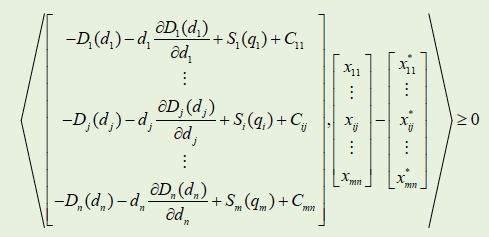

```{r setup, include=FALSE}
options(htmltools.dir.version = FALSE,
        echo = FALSE, message = FALSE, warning = FALSE)

knitr::opts_chunk$set(echo=F,
                      message=F,
                      warning=F,
                      fig.retina = 2,
                      fig.align = "center")

```

```{r xaringan-themer, include=FALSE, warning = FALSE}
library("tidyverse")
library("mosaic")
library("ggrepel")
library("fontawesome")


xaringanExtra::use_tile_view()
xaringanExtra::use_tachyons()
xaringanExtra::use_freezeframe()
xaringanExtra::use_share_again()
```


```{r echo = FALSE, warning=FALSE, message = FALSE}
library(tidyverse)
library(Deriv)
library(directlabels)
library(cowplot) # for arranging plots
library(DT)


```


# Mercado Monopolista em Rede


$$\max \,z(w)=\sum_{j=1}^{n}d_j\ D_j(d_j)  - \sum_{i=1}^{m}\int_{0}^{q_i} S_i(w) \,dw - \sum_{i=1}^{m}\sum_{j=1}^{n}\int_{0}^{x_{ij}} C_{ij}(w) \,dw\\$$

$$\textrm{s.a.} \sum_{j=1}^{n}x{ij}=q_i \ \ \ \ \ \  \forall i=1,...m$$

$$\sum_{i=1}^{m}x{ij}=d_j \ \ \ \ \ \  \forall j=1,...n$$
$$x{ij}\geq0 \ \ \ \ \ \  \forall i,j$$

- Quando um mercado monopolista opera em rede, a função que o monopolista desejará maximizar não será mais a do excedente da sociedade e sim o próprio Lucro:


---

# Parâmetros do modelo

Sejam:

$\rho_i=S_i(w)$:    Curva inversa da oferta associada ao mercado produtor $i$;

$\pi_i=D_j(w)$:   Curva inversa da demanda associada ao mercado consumidor $j$;

$C_{ij}(w)$:    Custo marginal de transporte associada ao transporte no arco $i \rightarrow j$;

$q_i$:    Quantidade produzida no mercado produtor $i$ (1 a $m$);

$d_j$:    Quantidade consumida no mercado consumidor $j$ (1 a $n$);

$x_{ij}$:   Fluxo do produto no arco $i \rightarrow j$

$q_i^*$:    Quantidade ótima produzida no mercado produtor $i$ (1 a $m$);

$d_j^*$:    Quantidade ótima consumida no mercado consumidor $j$ (1 a $n$);
---

background-image: url("rede.jpg")
background-size: contain

## Representação da Rede (visualmente a mesma que no caso da concorrência perfeita)


---
# Excedentes no mercado em rede

- Na condição de equilíbrio entre um produtor $i$ e um consumidor $j$ se a soma dos custos marginais de produção $\rho_i$ e transporte $c_{ij}$ forem iguais ao preço no mercado consumidor $\pi_j$, haverá fluxo de mercadorias $x_{ij}$ entre $i$ e $j$, portanto :

$$\rho_i+c_{ij}=\pi_j$$ então $$x_{ij} \geq 0$$

.pull-left[

- Já, o excedente do produtor será:

$$EP_i=q_i^*S_i(q_i^*)-\int_{0}^{q_i}S_i(w)\,dw$$
- O excedente do consumidor será:

$$EC_j=\int_{0}^{d_j}D_j(w)\,dw-d_j^*D_j(d_j^*)$$
]

.pull-right[

- Portanto:

$$EM_{ij}=x_{ij} \left[ D_j(d_j^*)-S_i(q_i^*) \right]$$ $$-\int_{0}^{x_{ij}}C_{ij}(w)\,dw$$

]


---
# Mercado de Refino de Petróleo

## Modelo em Rede

- Vamos assumir que o mercado de refino de petróleo seja agora controlado por um mesmo conglomerado e que portanto, as duas regiões produtoras do exemplo anterior sejam controladas por um monopolista.

- o mercado do refino está subdivido em múltiples mercados, localmente (espacialmente) distribuidos.

- Ou seja, as refinarias encontram-se em pontos distintos e o consumo (postos de gasolina p.ex.) encontram-se em outros pontos, sendo necessário o transporte do produto (gasolina p.ex.)


---
# Ampliando o mercado de refino

- Abaixo mostram-se as funções de oferta das duas regiões controladas pelo monopolista (note-se que os dados são os mesmos do exemplo de concorrência perfeita):

| Produtor | Produção (barris) | Função de Oferta                          |
|-----------------|----------------------|---------------------------------|
| P1       | $q_1$             | $$  \rho_1=S_1(q_1)=10+0,22q_1 $$         |
| P2       | $q_2$             | $$  \rho_2=S_2(q_2)=12+0,15q_2 $$         |


Onde $q_i$ está em milhares de barris por dia e $\rho_1$ e $\rho_2$ são funções (inversas) de oferta respectivamente e estão em dólares americanos ($/barril)

---

# Ampliando o mercado de refino

 - Assim, vamos assumir três pontos consumidores com as funções de demanda a seguir:
 
| Consumidor | Demanda (barris) | Função de Demanda                          |
|-----------------|----------------------|---------------------------------|
| C1       | $d_1$             | $$  \pi_1=D_1(d_1)=30-0,07d_1 $$         |
| C2       | $d_2$             | $$  \pi_2=D_2(d_2)=40-0,12d_2 $$         |
| C3       | $d_3$             | $$  \pi_3=D_3(d_3)=35-0,05d_3 $$         |


Onde $d_j$ está em milhares de barris por dia e $\pi_1$, $\pi_2$  e $\pi_3$ são funções (inversas) de demanda e estão em dólares americanos ($/barril)

---
Por fim, vamos assumir que os mesmos custos de transporte do exemplo da concorrência perfeita entre cada nó, da forma a seguir:

| $$ C_{ij}  $$ | C1  | C2  | C3  |
|---------------|-----|-----|-----|
| P1            | 3,0 | 3,5 | 5,4 |
| P2            | 6,4 | 3,2 | 2,9 |

---
# Resolução

## Definir as funções de demanda, oferta e custos de transporte

- Vamos utilizar o `r fa("r-project")` para resolver o problema de maximização.

.pull-left[

```{r echo=TRUE}

D1 <- function(w) 30 - 0.07*w

D2 <- function(w) 40 - 0.12*w

D3 <- function(w) 35 - 0.05*w

S1 <- function(w) 10 + 0.22*w

S2 <- function(w) 12 + 0.15*w

```

]

.pull-right[

```{r echo = TRUE}

c11 <- function(w) 3 + 0*w

c12 <- function(w) 3.5 + 0*w

c13 <- function(w) 5.4 + 0*w

c21 <- function(w) 6.4 + 0*w

c22 <- function(w) 3.2 + 0*w

c23 <- function(w) 2.9 + 0*w

```


]


---
class: center, middle, inverse

# O problema do equilíbrio espacial de preços usando Inequações Variacionais

Com base nas notas de aula do Prof. Sérgio F. Mayerle

---
# Formulação VIP para a monopólio


- O vetor $x^* = c(x_{11}^*,...x_{ij}^*,...,x_{mn}^*)$ [e uma solução para o problema de equilíbrio no mercado monopolista se satisfaz o seguinte problema de inequações variacionais:

```{r fig.align = "center", echo = FALSE}


```

---
## Definido a função F(x)

- A função $F(x) = - \nabla\ z(x)$ será igual a 

$$ 
\begin{bmatrix}
-D_1(d_1) - d_1\ \frac{\partial D_1(d_1)}{\partial d_1} + S_1(q_1)+C_{11} \\
. \\
.\\
.\\
-D_j(d_j) - d_j\ \frac{\partial D_j(d_j)}{\partial d_j} + S_i(q_i)+C_{ij}\\
.\\
.\\
.\\
-D_1(d_n) - d_n\ \frac{\partial D_n(d_n)}{\partial d_n} + S_m(q_m)+C_{mn}
\end{bmatrix}
$$
- O termo adicional $\frac{\partial D_j(d_j)}{\partial d_j}$ representa o trade-off da Receita Marginal do Monopolista.

---
## Definir as funções de demanda, oferta e custos de transporte

- Vamos utilizar o `r fa("r-project")` para resolver o problema de maximização. São as mesmas funções do exemplo anterior.

.pull-left[

```{r echo=TRUE}

D1 <- function(w) 30 - 0.07*w

D2 <- function(w) 40 - 0.12*w

D3 <- function(w) 35 - 0.05*w

S1 <- function(w) 10 + 0.22*w

S2 <- function(w) 12 + 0.15*w

```

]

.pull-right[

```{r echo = TRUE}

c11 <- function(w) 3 + 0*w

c12 <- function(w) 3.5 + 0*w

c13 <- function(w) 5.4 + 0*w

c21 <- function(w) 6.4 + 0*w

c22 <- function(w) 3.2 + 0*w

c23 <- function(w) 2.9 + 0*w

```


] 

---
## Definir as funções $f_{ij}$


- Seguindo a notação da gradiente $-\nabla\ z(ij)$ precisamos definir o termo $d_j\ \frac{\partial D_j(d_j)}{\partial d_j}$:

```{r echo = TRUE}
library(Deriv)

rt1 <- Deriv(D1, "w")

rmg1 <- function(w) w*rt1(w)


rt2 <- Deriv(D2, "w")

rmg2 <- function(w) w*rt2(w)

rt3 <- Deriv(D3, "w")

rmg3 <- function(w) w*rt3(w)

```

---
## Definir as funções $f_{ij}$

Agora sim, podemos construir a gradiente:

.pull-left[


```{r echo = TRUE}

f11 <- function(d,q){
  -D1(d) - rmg1(d) + S1(q) + c11(d)
}

f12 <- function(d,q){
  -D2(d) - rmg2(d) + S1(q) + c12(d)
}

f13 <- function(d,q){
  -D3(d) - rmg3(d) + S1(q) + c13(d)
}
```


]

.pull-right[

```{r echo = TRUE}

f21 <- function(d,q){
  -D1(d) - rmg1(d) + S2(q) + c21(d)
}

f22 <- function(d,q){
  -D2(d) - rmg2(d) + S2(q) + c22(d)
}

f23 <- function(d,q){
  -D3(d) - rmg3(d) + S2(q) + c23(d)
}

```


]

---
## Construir função VIP


- Vamos utilizar o `r fa("r-project")` para construir uma função de inequações variacionais

.pull-left[

```{r echo=TRUE, eval = FALSE}

vip_func <- function(x11,x12,x13,
                     x21,x22,x23, 
                     alpha){
	
d1 <- x11 + x21
d2 <- x12 + x22
d3 <- x13 + x23
q1 <- x11 + x12 + x13
q2 <- x21 + x22 + x23
	
X <- c(x11, x12, x13,
	  x21, x22, x23)

	
Fx <- c(f11(d1,q1), 
        f12(d2,q1), 
        f13(d3,q1), 
        f21(d1,q2), 
        f22(d2,q2), 
        f23(d3,q2))
	
```
]

.pull-right[

```{r echo = TRUE, eval = FALSE}

#continua aqui

vip <- data.frame(X=X, Fx=Fx)

vip <- vip %>%
	 mutate(
		 Y=X-(alpha*Fx),
         PY = ifelse(Y<=0, 0, Y),
         Erro = (X-PY)^2)

X_vip <- vip$PY
erro <- sum(vip$Erro)
rmse <- sqrt(erro/length(X_vip))	
	return(c(X_vip, rmse))
	
}

```
]

```{r}
vip_func <- function(x11,x12,x13,x21,x22,x23, alpha){
	
d1 <- x11 + x21
d2 <- x12 + x22
d3 <- x13 + x23
q1 <- x11 + x12 + x13
q2 <- x21 + x22 + x23
	
X <- c(x11, x12, x13,
	  x21, x22, x23)

	
Fx <- c(f11(d1,q1), 
        f12(d2,q1), 
        f13(d3,q1), 
        f21(d1,q2), 
        f22(d2,q2), 
        f23(d3,q2))
	
vip <- data.frame(X=X, Fx=Fx)

vip <- vip %>%
	 mutate(
		 Y=X-(alpha*Fx),
         PY = ifelse(Y<=0, 0, Y),
         Erro = (X-PY)^2)

X_vip <- vip$PY
erro <- sum(vip$Erro)
rmse <- sqrt(erro/length(X_vip))	
	return(c(X_vip, rmse))
	
}
```

---
## Vetor de soluções X

.pull-left[

Inicializamos a resolução com um vetor de soluções X

```{r echo = TRUE}

X <- c(10,10,10,
	  10,10,10)
```


Com esse vetor rodamos a primeira iteração

```{r echo = TRUE}

X_vip <- vip_func(as.numeric(X[1]), 
                  as.numeric(X[2]),
                  as.numeric(X[3]),
                  as.numeric(X[4]),
                  as.numeric(X[5]),
                  as.numeric(X[6]), 
                  0.5)

```

]

.pull-right[

Podemos ver os resultados do vetor abaixo

```{r}
library(knitr)

x <- data.frame(xij = c("x11","x12","x13",
                        "x21", "x22","x23"))

x %>% 
  mutate(valor = round(X_vip[1:6],2)) %>% 
  kable()


```

E o valor do RMSE = `r as.numeric(X_vip[7])`

]

---
## Agora rodamos a iteração

.pull-left[

- agora rodamos um loop até que a raiz do erro quadrático médio (rmse) seja <= 0.00001. 

- Estamos usando $\alpha=0,5$

```{r echo = TRUE}

while(as.numeric(X_vip[7]) > 0.00001) {
	X_vip <- vip_func(as.numeric(X_vip[1]),
	                  as.numeric(X_vip[2]),
	                  as.numeric(X_vip[3]),
	                  as.numeric(X_vip[4]),
	                  as.numeric(X_vip[5]),
	                  as.numeric(X_vip[6]), 
	                  0.5)
}


```

]

.pull-right[

Podemos ver os resultados finais abaixo

```{r}
library(knitr)

x %>% 
  mutate(valor = round(X_vip[1:6],2)) %>% 
  kable()

```

E o valor do RMSE = `r format(X_vip[7], scientific = FALSE)`

]

---
## Agora rodamos a iteração

.pull-left[

O resultado é mais preciso do que utilizando o processo de maximização com restrição

```{r fig.align = "center", echo = FALSE}


```

]

.pull-right[

Podemos ver os resultados finais abaixo

```{r}

x %>% 
  mutate(valor = round(X_vip[1:6],2)) %>% 
  kable()

```

E o valor do RMSE = `r format(X_vip[7], scientific = FALSE)`

]

---

Vamos salvar os valores individualmente:

```{r echo=TRUE}
x11_otimo <- X_vip[1]
x12_otimo <- X_vip[2]
x13_otimo <- X_vip[3]
x21_otimo <- X_vip[4]
x22_otimo <- X_vip[5]
x23_otimo <- X_vip[6]
```


---
# Excedentes

.pull-left[

Excedentes do Produtor Monopolista:

```{r}

q1 <- x11_otimo+x12_otimo+x13_otimo
q2 <- x21_otimo+x22_otimo+x23_otimo


```

EP = xxx Milhoes USD

]

.pull-right[

Excedentes do Consumidor:

```{r echo = TRUE}

d1 <- x11_otimo+x21_otimo
d2 <- x12_otimo+x22_otimo
d3 <- x13_otimo+x23_otimo

EC1 <- integrate(D1, lower =0, upper = d1)$value - d1*D1(d1) 
EC2 <- integrate(D2, lower =0, upper = d2)$value - d2*D2(d2) 
EC3 <- integrate(D3, lower =0, upper = d3)$value - d3*D3(d3) 

EC <- EC1 + EC2 + EC3

```

EC = `r round(EC,2)` Mi USD

Excedente do Mercado = xxx Mi USD
]
---
class: center, middle

# Fim do Apêndice

Prof. Mauricio Uriona Maldonado